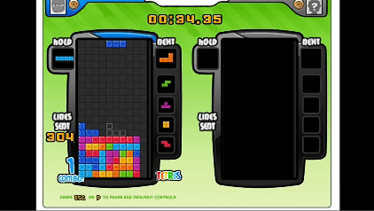

# Machine Learning for Tetris Battle

This project aims to train an AI agent for the popular Facebook game—Tetris Battle. The game's source code can be found at [https://github.com/ylsung/TetrisBattle](https://github.com/ylsung/TetrisBattle).

It is a highly restored version of original game, with features as follow: <br/>
- 2 players <br/>
- UI  <br/>
- T spin and Tetris <br/>
- back to back <br/>
- garbage lines <br/>
- alarm for attacks <br/>

The repository contains:

1. Single player mode (with Q-Learning AI agent)
2. Two players mode (with our (Team 38) Q-Learning AI agent and Team 37 AI agent)

Presented as our final project for the course CS460200, Introduction to Machine Learning, we are Group 38. In a friendly competition, we pitted our skills against Team 37.

## Group Members

- **Cheng-Ning Huang**  
  **Role:** Project Manager  
  **Email:** hcn1222@gapp.nthu.edu.tw  

- **Pei-Jen Chen**  
  **Role:** Group Representative  
  **Email:** penny11124@gmail.com  

- **Hao-Wen Hsu**  
  **Role:** Game Producer  
  **Email:** vincent88588@gmail.com  

- **Po-Ching Wen**  
  **Role:** Information Gatherer  
  **Email:** annieeric520@gmail.com  

- **Jun-Ping Chou**  
  **Role:** Algorithm Designer  
  **Email:** terrychou911019@gmail.com  

- **You-Cheng Liu**  
  **Role:** Program Manager  
  **Email:** liu.zack0505@gmail.com  

## **Demo**

### Single player mode

demo the functions: back to back, tetris, combo.



### Two players mode

demo the functions: back to back, tetris, combo and ko. <br/>
right / left : Team 38 / Team 37


## **Requirements**
```
python3 
pygame 
Linux system 
```

## **Installation**
```
python setup.py develop
```

## **Usage**

### Single player mode

```
python -m game.tetris_game --mode single
```

### Two players mode

```
python -m game.tetris_game --mode double
```
### Train model

```
python train.py
```

### Single player mode with AI agent
```
(in test.py line 40)
env = TetrisSingleEnv(gridchoice="none", obs_type="image", mode="human")

(in command line)
python test.py
```

### Two players mode with Team 38 AI agent and Team 37 AI agent
```
(in test.py line 40)
env = TetrisDoubleEnv(gridchoice="none", obs_type="image", mode="human")

(in command line)
python test.py > record.txt
```
You can see the result in record.txt

## **Game Rules**

### End Game (jump out the main loop): <br/>

1. Press the upper right cross (evnt.type == pygame.QUIT) <br/>
2. Some player died (Stacked blocks reach top) <br/>
3. After the timer expires <br/>
### Victory or defeat: <br/>

1. If someone dies, the deceased loses. <br/>
2. Who has more send lines will win. <br/>
3. Comparing who has the lower top. <br/>
### Send line calculation: <br/>

1. cleared: <br/>
The number of lines to be deleted <br/>
2 rows: +1 point <br/>
3 rows: +2 points <br/>
4 rows: +4 points (Tetris) <br/>
2. combo: <br/>
Achieving consecutive line clears， <br/>
+(combo+1)/2 points (up to a maximum of 4 points) <br/>
3. T-spin: <br/>
Use T-shaped block to snap into the gap and eliminate two rows <br/>
+3分 <br/>
4. back to back: <br/>
Two adjacent eliminations are "Tetris" or "T-spin" <br/>
+2分 <br/>

**Group37_model.py and tetris file are belongs to Team 37**<br/>
**Team 38 trained models are in my_models folder**


## **Disclaimer**

This work is based on the following repos: <br/>
1. https://github.com/ylsung/TetrisBattle
2. https://github.com/uvipen/Tetris-deep-Q-learning-pytorch
